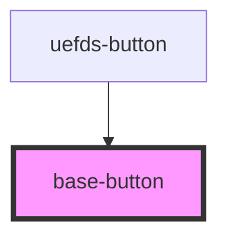

# base-button

<!-- Auto Generated Below -->

## Properties

| Property   | Attribute  | Description | Type                              | Default    |
| ---------- | ---------- | ----------- | --------------------------------- | ---------- |
| `disabled` | `disabled` |             | `boolean`                         | `false`    |
| `type`     | `type`     |             | `"button" \| "reset" \| "submit"` | `'button'` |

## Events

| Event         | Description | Type                      |
| ------------- | ----------- | ------------------------- |
| `buttonClick` |             | `CustomEvent<MouseEvent>` |

## Dependencies

### Used by

 - [uefds-button](../uefds-button)

### Graph

----------------------------------------------

*Built with [StencilJS](https://stenciljs.com/)*
