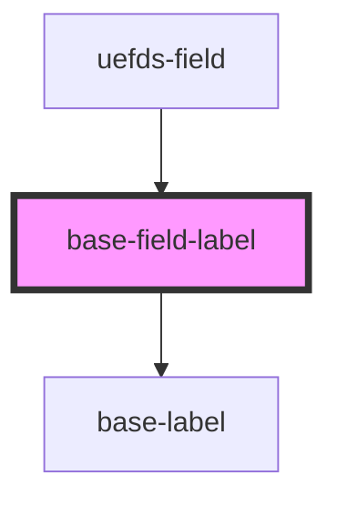

# base-field-label

<!-- Auto Generated Below -->

## Properties

| Property   | Attribute  | Description | Type      | Default |
| ---------- | ---------- | ----------- | --------- | ------- |
| `required` | `required` |             | `boolean` | `false` |

## Dependencies

### Used by

 - [uefds-field](../uefds-field)

### Depends on

- [base-label](../base-label)

### Graph

----------------------------------------------

*Built with [StencilJS](https://stenciljs.com/)*
