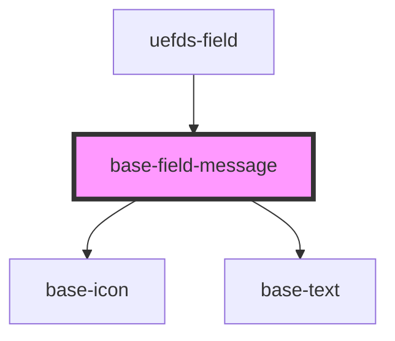

# base-field-message

<!-- Auto Generated Below -->

## Properties

| Property  | Attribute | Description | Type                              | Default     |
| --------- | --------- | ----------- | --------------------------------- | ----------- |
| `icon`    | `icon`    |             | `string`                          | `undefined` |
| `variant` | `variant` |             | `"danger" \| "info" \| "warning"` | `'danger'`  |

## Dependencies

### Used by

 - [uefds-field](../uefds-field)

### Depends on

- [base-icon](../base-icon)
- [base-text](../base-text)

### Graph

----------------------------------------------

*Built with [StencilJS](https://stenciljs.com/)*
