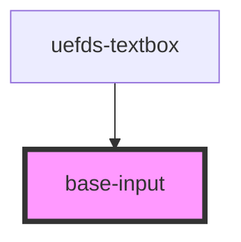

# base-input

<!-- Auto Generated Below -->

## Properties

| Property      | Attribute     | Description | Type      | Default     |
| ------------- | ------------- | ----------- | --------- | ----------- |
| `disabled`    | `disabled`    |             | `boolean` | `false`     |
| `maxlength`   | `maxlength`   |             | `number`  | `undefined` |
| `name`        | `name`        |             | `string`  | `undefined` |
| `placeholder` | `placeholder` |             | `string`  | `undefined` |
| `readonly`    | `readonly`    |             | `boolean` | `false`     |
| `required`    | `required`    |             | `boolean` | `false`     |
| `type`        | `type`        |             | `string`  | `'text'`    |
| `value`       | `value`       |             | `string`  | `''`        |

## Events

| Event         | Description | Type                  |
| ------------- | ----------- | --------------------- |
| `inputBlur`   |             | `CustomEvent<void>`   |
| `inputChange` |             | `CustomEvent<string>` |
| `inputFocus`  |             | `CustomEvent<void>`   |
| `inputInput`  |             | `CustomEvent<string>` |

## Dependencies

### Used by

 - [uefds-textbox](../uefds-textbox)

### Graph

----------------------------------------------

*Built with [StencilJS](https://stenciljs.com/)*
