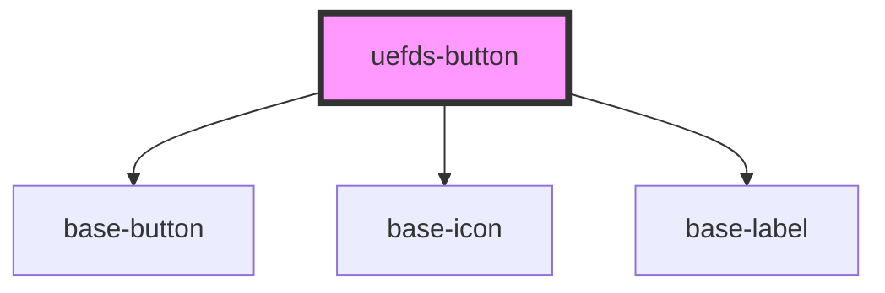

# uefds-button

<!-- Auto Generated Below -->

## Properties

| Property    | Attribute    | Description | Type                                                      | Default        |
| ----------- | ------------ | ----------- | --------------------------------------------------------- | -------------- |
| `busy`      | `busy`       |             | `boolean`                                                 | `false`        |
| `color`     | `color`      |             | `"danger" \| "info" \| "success" \| "theme" \| "warning"` | `'theme'`      |
| `direction` | `direction`  |             | `"horizontal" \| "vertical"`                              | `'horizontal'` |
| `disabled`  | `disabled`   |             | `boolean`                                                 | `false`        |
| `iconEnd`   | `icon-end`   |             | `string`                                                  | `undefined`    |
| `iconStart` | `icon-start` |             | `string`                                                  | `undefined`    |
| `size`      | `size`       |             | `"lg" \| "md" \| "sm"`                                    | `'md'`         |
| `text`      | `text`       |             | `string`                                                  | `undefined`    |
| `type`      | `type`       |             | `"button" \| "clear" \| "reset" \| "submit"`              | `'button'`     |
| `variant`   | `variant`    |             | `"link" \| "outline" \| "solid" \| "subtle"`              | `'solid'`      |

## Dependencies

### Depends on

- [base-button](../base-button)
- [base-icon](../base-icon)
- [base-label](../base-label)

### Graph

----------------------------------------------

*Built with [StencilJS](https://stenciljs.com/)*
