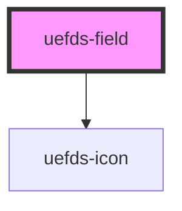

# uefds-field

<!-- Auto Generated Below -->

## Properties

| Property       | Attribute      | Description | Type             | Default     |
| -------------- | -------------- | ----------- | ---------------- | ----------- |
| `instructions` | `instructions` |             | `string`         | `undefined` |
| `label`        | `label`        |             | `string`         | `undefined` |
| `messages`     | --             |             | `FieldMessage[]` | `[]`        |
| `required`     | `required`     |             | `boolean`        | `false`     |
| `support`      | `support`      |             | `string`         | `undefined` |

## Dependencies

### Depends on

- [uefds-icon](../uefds-icon)

### Graph

----------------------------------------------

*Built with [StencilJS](https://stenciljs.com/)*
