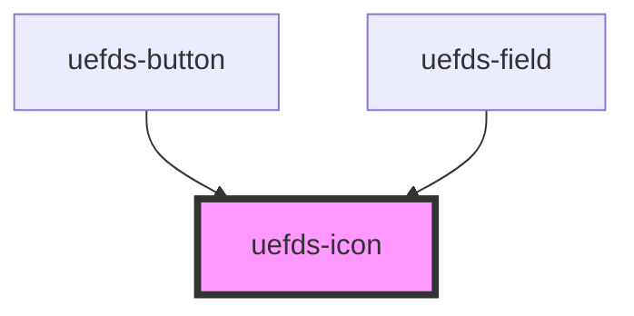

# uefds-icon

<!-- Auto Generated Below -->

## Properties

| Property | Attribute | Description | Type                           | Default     |
| -------- | --------- | ----------- | ------------------------------ | ----------- |
| `name`   | `name`    |             | `string`                       | `undefined` |
| `size`   | `size`    |             | `"lg" \| "md" \| "sm" \| "xl"` | `'md'`      |

## Dependencies

### Used by

 - [uefds-button](../uefds-button)
 - [uefds-field](../uefds-field)

### Graph

----------------------------------------------

*Built with [StencilJS](https://stenciljs.com/)*
