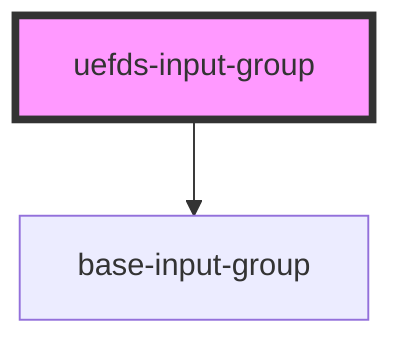

# uefds-input-group

<!-- Auto Generated Below -->

## Properties

| Property   | Attribute  | Description | Type                     | Default  |
| ---------- | ---------- | ----------- | ------------------------ | -------- |
| `disabled` | `disabled` |             | `boolean`                | `false`  |
| `error`    | `error`    |             | `boolean`                | `false`  |
| `size`     | `size`     |             | `"base" \| "lg" \| "sm"` | `'base'` |

## Dependencies

### Depends on

- [base-input-group](../base-input-group)

### Graph

----------------------------------------------

*Built with [StencilJS](https://stenciljs.com/)*
